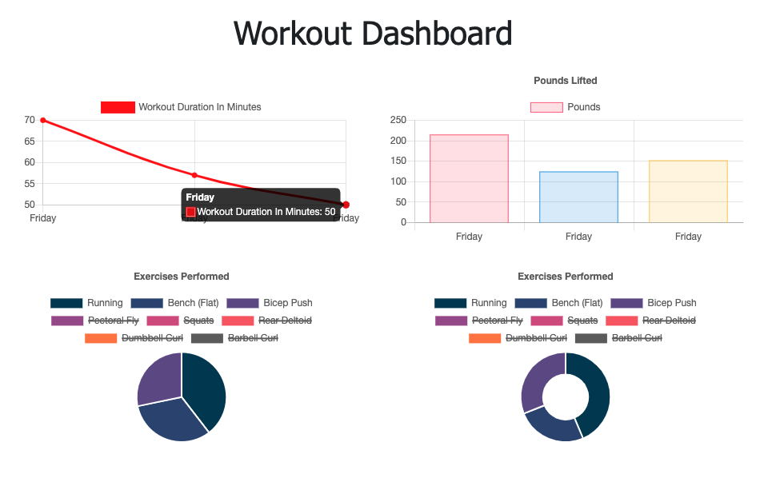

# Fitness-Tracker :runner: :running:

Welcome to 2021! Since we're all still stuck at home all the time, we'd might as well get in shape! Using this application, you'll be able to keep track of your weekly fitness goals through beautifully-rendered graphs.

[Heroku Link](https://calm-coast-89616.herokuapp.com/)

## TABLE OF CONTENTS

-[Features](#Features)

-[Dependencies](#Dependencies)

-[Screenshots](#Screenshots)

-[Contact](#Contact)

## FEATURES

- Upon first visiting the application, you will be prompted to enter your fitness goals for the day. As you enter more data after each workout, graphs will be populated with data showing your 7-day workout trends.

- Uses a MongoDB database to store user-entered workout data which will be used to display your fitness habits.

## DEPENDENCIES

-[Express](https://www.npmjs.com/package/express)

-[Node](https://www.npmjs.com/package/node)

-[Mongoose](https://www.npmjs.com/package/mongoose)

-[Morgan](https://www.npmjs.com/package/morgan)

## SCREENSHOTS

